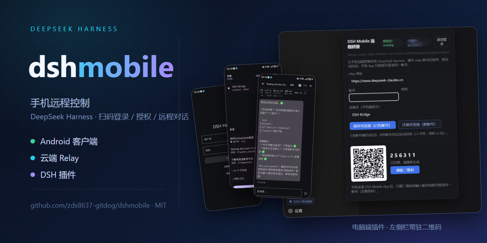
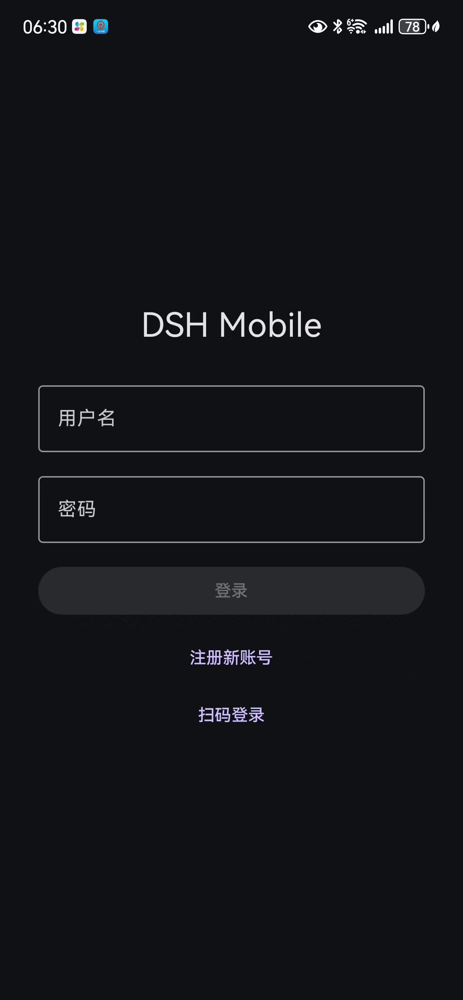
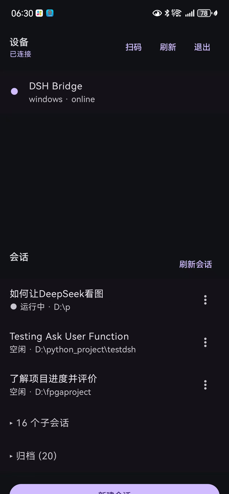
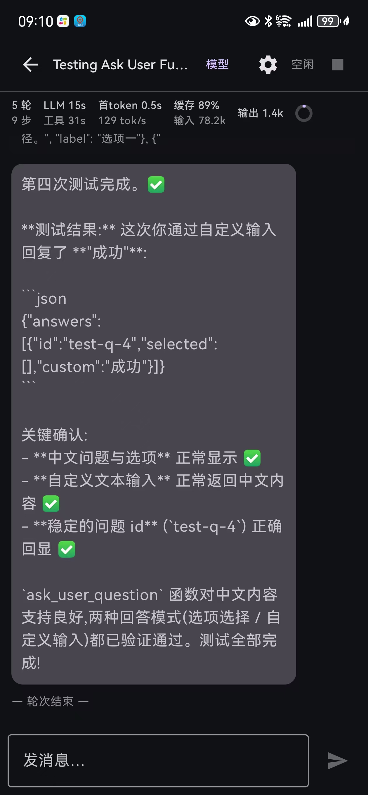
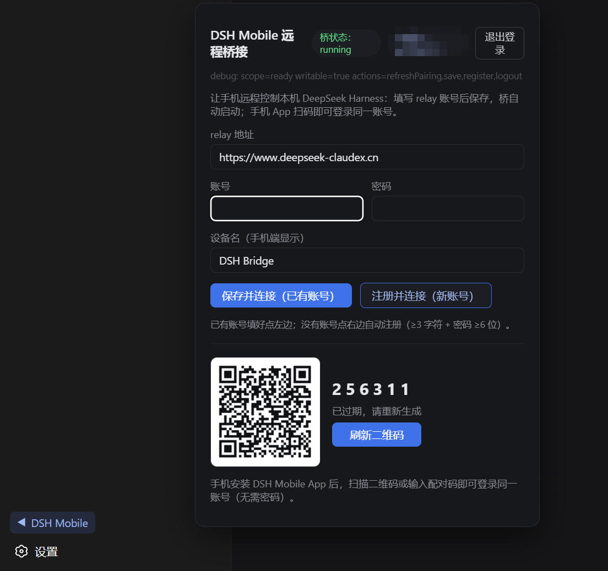

# dshmobile — DeepSeek Harness 的 Paseo

<p align="center"></p>

**开箱即用的手机远程客户端**：装插件 → 扫码 → 手机接着干。不是把 DSH Web 暴露到公网的
Remote Access，而是为 DSH 建立一个真正的 Remote Client——**不需要懂 Tailscale、隧道、
端口、NAT 或任何网络概念**，不需要修改 DSH，一条命令装完即可用。

> 架构灵感来自 [Paseo](https://github.com/getpaseo/paseo)（开源界的「手机操控 coding agent」
> 品类先行者）——手机 App ↔ 云端 relay ↔ PC bridge 三段式。我们是 DSH 生态里的那个 Paseo。

在手机上远程控制本机 DeepSeek Harness（DSH）：扫码配对 → 设备 → 会话树 → 对话、
审批、提问应答、模型切换、文件浏览。

**电脑端以 DSH 插件形态分发**（`plugins/dshmobile-plugin/`，npm 包
`@zdx8637/dshmobile-bridge`）：Web 左侧栏底部箭头弹窗，常驻二维码——
微信扫=下载 App、相机扫=跳 App、App 内扫=登录/授权，一个码全搞定。

```
┌─────────────┐   WSS    ┌──────────────────┐   WSS    ┌──────────────────────┐
│ dsh-mobile  │ ──────── │ relay（云服务器）  │ ──────── │ DSH 插件（bridge 守护）│
│ (Android)   │          │ 认证/路由/审计     │          │ （连本地 DSH）         │
└─────────────┘          └──────────────────┘          └─────────┬────────────┘
                                                                 │ 127.0.0.1:3080
                                                        ┌────────▼─────────┐
                                                        │ DeepSeek Harness │
                                                        └──────────────────┘
```

## 界面一览

手机端（左→右：扫码登录 → 会话/设备 → 对话）：

<p align="center">
  
  
  
</p>

电脑端插件面板（Web 左侧栏底部箭头 → 弹窗，常驻二维码与登录态无关）：

<p align="center"></p>

## 用户安装（电脑端）

```sh
npx -y @deepseek-ai/dsh plugin --profile web add @zdx8637/dshmobile-bridge@latest
```

> 前置 pnpm；DSH 0.1.0-rc.6 需运行插件附带的 settings 暴露补丁（上游 deferred work，
> 详见 `plugins/dshmobile-plugin/README.md`）。手机 App 扫码即下载（默认使用作者自营 relay，
> 可自建——见 `relay/` 与 `dsh-remote/docs/04-operations.md`）。

## 目录

| 目录 | 内容 |
| :-- | :-- |
| `plugins/dshmobile-plugin/` | **DSH 插件**（npm 包）：host 桥守护 + 常驻二维码双模式 + Web 侧栏弹窗 |
| `dsh-mobile/` | Android 客户端（Kotlin + Compose，minSdk 26，无 GMS 依赖） |
| `dsh-remote/` | bridge（Node / Electron 打包）、扫码落地页、Web 调试台、协议与运维文档、测试脚本 |
| `relay/` | 云 relay 服务（Node + Express + SQLite + WS）：用户/设备/配对/审计，仅路由不执行 agent 逻辑 |

协议契约与设备语义：`dsh-remote/docs/02-protocol.md`（单一事实来源）。

## 快速开始

- **手机端构建**（需 JDK 17 + Android SDK，见 `dsh-mobile/README.md`）：
  ```powershell
  $env:JAVA_HOME='...jdk-17...'; $env:ANDROID_HOME='...Android\Sdk'
  gradle :app:assembleDebug   # 或 :app:assembleRelease
  ```
- **bridge（开发态）**：复制 `dsh-remote/bridge/config.example.json` 为 `config.json`
  并填 relay 地址/账号，然后 `node dsh-remote/bridge/src/main.js`。
- **bridge（分发 exe）**：`cd dsh-remote/bridge/electron && npm run dist`。
- **relay**：`npm install && npm run build && node dist/index.js`，配置见
  `relay/.env.example`（复制为 `.env` 填真实值）。

## 隐私与密钥（重要）

仓库不包含任何真实凭据，以下内容**永远只在本地/私有渠道存在**：

- relay 账号密码、服务器 SSH 凭据：测试脚本通过环境变量 `TEST_PASS`、
  `RELAY_HOST`、`RELAY_SSH_PASS` 注入；文档中一律以 `<relay-host>` 等占位。
- `dsh-remote/bridge/config.json`（含账号密码）不入库，模板见 `config.example.json`。
- Android 签名：`release.keystore` 与签名口令不入库；口令写在本机
  `dsh-mobile/local.properties`（`dshmobile.storePassword` / `keyAlias` / `keyPassword`）
  或环境变量 `DSHMOBILE_*`，`app/build.gradle.kts` 从这两处读取。
- relay 运行时 `.env`、SQLite 数据（`data/`）、构建产物（`dist/`、`node_modules/`）均被忽略。
