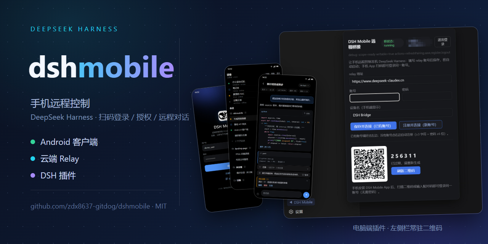

# dshmobile — Remote Mobile Client for DeepSeek Harness

[中文文档](./README.zh.md)

<p align="center"></p>

**Zero-friction**: one command installs the plugin → scan a QR code → keep working from your phone.
A true Remote Client for DSH — no Tailscale, tunnels, port forwarding, NAT, or networking knowledge
required, no DSH modifications, cross-platform.

Control your local DeepSeek Harness (DSH) from your phone: scan to pair → device → session tree →
chat, approvals, question answering, model switching, file browsing.

## Architecture

```
┌──────────────┐   WSS    ┌───────────────────┐   WSS    ┌───────────────────────────┐
│ Android App  │ ───────▶ │  Cloud Relay       │ ◀─────── │ PC Bridge (DSH plugin)     │
│ (signed APK) │          │ (hosted service)   │          │ (open source)              │
└──────────────┘          └───────────────────┘          └────────────┬──────────────┘
                                                                       │ 127.0.0.1:3080
                                                             ┌─────────▼──────────┐
                                                             │ DeepSeek Harness   │
                                                             └────────────────────┘
```

Business content (prompts / replies / sessions / files) is protected by **E2EE end-to-end
encryption**: the relay only sees routing metadata — it can neither read nor tamper with your
session content. The connection layer self-heals: after a DSH restart or a network hiccup it
re-handshakes automatically, no manual steps required.

## Open Source & Security

| Component | Status | Notes |
| :-- | :-- | :-- |
| **PC Bridge / plugin** | Open Source (MIT) | `plugins/`, npm package `@zdx8637/dshmobile-bridge` |
| **Protocol contract** | Open | `docs/02-protocol.md` (single source of truth for the wire format) |
| **E2EE design** | Open and auditable | `docs/plan-e2ee.md` (threat model + crypto parameters + handshake) |
| **Android App** | Signed APK distribution | Download by scanning the QR code |
| **Cloud Relay** | Hosted service | Auth / routing / audit |

The protocol and crypto implementations are fully public and independently auditable; business
content is end-to-end encrypted, and the relay only forwards routing metadata — it cannot read
your sessions.

## Installation

### PC (Bridge plugin)

```sh
npx -y @deepseek-ai/dsh plugin --profile web add @zdx8637/dshmobile-bridge@latest
```

> Requires `pnpm`. After restarting DSH, a ▶ panel appears at the bottom of the web sidebar:
> ① login / grant code, ② encrypted pairing code. Current plugin version: **1.0.0**.

### Phone (Android App)

Scan the QR code on the PC panel → download the signed APK from the landing page (current version
**v1.0.0**). Then scan in the App: ① first to log in, ② then for E2EE pairing — once paired, a
**shield badge** appears in the device list (E2EE is active). A shield with a slash means plaintext;
both are grey — the difference is the shape, not the colour.

## DSH Version Requirement

The plugin **supports the v2 protocol only, i.e. DSH v0.1.5 or newer**. The legacy protocol for
older DSH builds was **removed entirely** in `0.1.0-beta.23`.

| DSH version | Plugin behavior |
| :-- | :-- |
| **v0.1.5 or newer** | Full support: `/api` session auth (launch token → session Cookie), Typert endpoints (`session/*` etc.), `/api/remote.mux` stream multiplexing, `$events` approval/question waterfalls |
| **v0.1.0-rc.6 or older** | **Not supported** — upgrade DSH first, then install this plugin |

> This is a deliberate narrowing: the dual-protocol branch was a long-standing defect hotspot, since
> every change had to be verified on both paths. If you are still on a pre-v2 DSH, stay on
> `0.1.0-beta.22`, or upgrade DSH first.

## Directory

| Path | Contents |
| :-- | :-- |
| `plugins/` | PC Bridge plugin (host + bridge daemon + web panel), open source |
| `docs/02-protocol.md` | Relay envelopes, message types, device semantics (wire-format contract) |
| `docs/plan-e2ee.md` | E2EE v1 design (threat model, cryptography, handshake, pinning) |
| `docs/e2ee-identity-issues.md` | E2EE identity/pairing investigation (torn-read key regeneration, restart self-heal, etc.) |
| `docs/bridge-singleton.md` | Bridge single-instance protection: why duplicate bridges fight, the four defence layers, diagnostics |

## Trust & Self-hosting (roadmap)

- Today the relay is a hosted service operated by the author; content privacy is guaranteed by
  E2EE, and the relay only routes and forwards metadata.
- A **reference self-hosted relay** (reference implementation, ≠ the production service) will be
  released later so you can self-host: `Android → self-hosted relay → Bridge → DSH`. Account
  system, monitoring, and scaling remain the operator's concern.

## Privacy & Secrets

This repository contains no real credentials. Android signing keys, relay account passwords, and
server SSH credentials live only in local/private channels — always injected via environment
variables and referenced as placeholders in docs.
