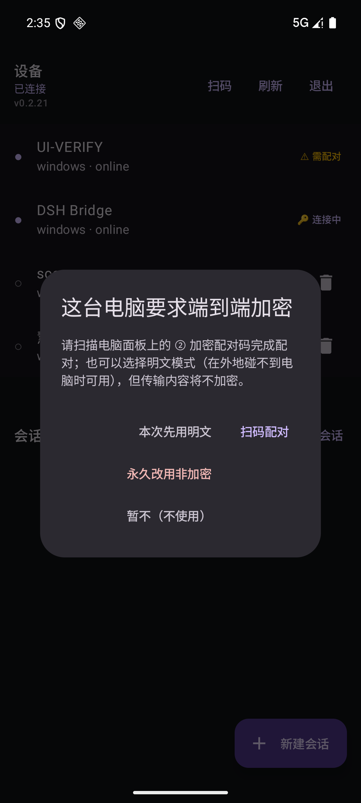
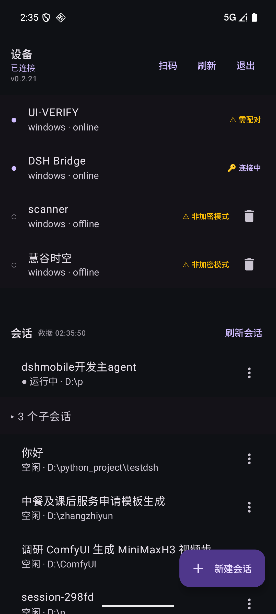

# 默认端到端加密 + 明文必须显式选择（方案 D：桥 beta.25 / App 0.2.21）

> 起因（用户实测）：PC 端已配对时，**新装/重装 App 的手机**（本机无 pin）发明文请求被**静默放行**，
> 既不提示配对、也不提示"你在明文"。产品定调：**始终默认 E2EE，只有用户明确选择才走明文**；
> 同时必须（a）不卡死老客户端、（b）人在外地碰不到电脑面板时也能选择明文凑合。

## 1. 设计原则

| 原则 | 落地 |
|---|---|
| **默认加密** | 桥侧持久化策略 `e2ee-policy.json`：`require` **默认 true**（文件不存在即 true）；配对成功自动回到 true |
| **明文必须显式** | 三条明确入口：① 手机"本次先用明文"（桥只在**本进程**放行该 clientId，桥重启即恢复要求）② 手机/面板"永久改用非加密"（清两端 pin + 落盘 `require:false`）③ 老客户端（版本闸门 fail-open，见 §4） |
| **不静默** | 设备行徽标两态常驻（🔑 加密 / ⚠ 非加密模式）+ 会话页顶栏"⚠ 非加密"；桥要求加密而本机没配对时**主动弹框** |
| **不骚扰** | 点「暂不（不使用）」后不再反复弹框（设备行 ⚠️ 需配对 常驻提醒，点徽标可重新选择） |
| **离线可操作** | "改用明文"是**手机侧动作**，经 relay 发给桥，不需要用户人在电脑旁（配对才需要扫电脑面板的 ② 码） |

## 2. 状态机（设备行两态 + 两个过渡态）

| 状态 | 条件 | 徽标 |
|---|---|---|
| `ENCRYPTED` | 本机有 pin 且桥已配对、已连接 | 🔑 加密 |
| `CONNECTING` | 本机有 pin 但连接未建立/未确认 | 🔑 连接中 |
| `NEEDS_PAIRING` | 桥要求加密但本机无 pin | ⚠ 需配对（黄，点开可选三条路） |
| `PLAINTEXT` | 桥未要求加密，或用户已选择非加密 | ⚠ 非加密模式（黄，常驻） |

## 3. 协议增量（只增字段/只加帧/只加类型）

| 方向 | 名称 | 说明 |
|---|---|---|
| App → 桥 | 信封顶层 `appVersion` | 版本闸门 + 遥测（例 `"0.2.21"`） |
| App → 桥 | `e2ee.state` | 回 `{require,pinned,bridgeKeyId}`；**明文类型**，即使会话列表被拒也能调用 |
| App → 桥 | `e2ee.allowPlaintext {deviceId,mode}` | `session`=仅本进程放行该 clientId（不清 pin、不改策略）；`permanent`=清 pin + 落盘 `require:false` |
| 桥 → App | `sessions.list` 的 `data.e2ee` | `{require,pinned,bridgeKeyId}` |
| 桥 → App | 事件帧 `host/e2ee-state` | pin/策略变化时推送（快照去重）；客户端首次上报 `appVersion` 时也会推 |
| 桥 → App | `E2EE_REQUIRED` 的 `error.data` | `{reason:"require-e2ee",require,pinned,bridgeKeyId}` |

## 4. 版本闸门（为什么不会卡死老客户端）

桥只在**该客户端已上报 `appVersion` 且 ≥ 0.2.21** 时才强制加密；未知/老版本（含所有 ≤0.2.20）
**一律放行（fail-open）**。理由：`E2EE_REQUIRED` 的对话框是 0.2.17 才有的，更老的 App 收到该错误
只会表现为"列表空"，且没有配对入口 → 会真的卡住。

⇒ **发布顺序必须 App 先行**：先铺 0.2.21，再让桥（beta.25）默认强制；老用户升级 App 后自动纳入
"默认加密"，未升级者体验不变（仍明文、不提示）。

## 5. 验证

- 桥：`scripts/smoke-e2ee-require.mjs` **78 断言**（含版本边界 14 例、session 放行只对该 clientId 且
  桥重启失效、permanent 落盘+清 pin、配对后 require 回 true、8 个控制类永不被拒）；
  7 个既有 smoke 全绿；负向控制（强制分支置 false）→ 13 FAIL，恢复后哈希一致。
- App：单测 **48 项**全绿（新增 `E2eeStatusTest` 8 项：状态映射 / 是否需提示 / 徽标文案 / 容错解析）。
- 端到端（Android 模拟器 + **隔离的临时桥与临时设备**，全程未触碰生产配对）：
  1. 无 pin 的 0.2.21 + `require=true` → **弹出「这台电脑要求端到端加密」**（本轮修复的核心，见上图）；
  2. 选「本次先用明文」→ 列表加载、徽标转 ⚠ 非加密模式；
  3. 徽标 → 设置弹窗 → 「永久改用非加密」→ 桥侧 `e2ee-policy.json` 落盘 `{"require":false}`；
  4. 恢复 `require=true` + 重启桥与 App → **弹框重新出现且不给数据**（无静默明文）。

## 6. 面板（PC 侧）状态展示（**只读**）

`/state` 每次现读策略文件与 `device-key.json`，因此**手机端操作后刷新面板即可看到**：

| 字段 | 含义 |
|---|---|
| `e2eeRequire` | 是否要求端到端加密（策略文件缺失/坏 → true，与桥一致） |
| `e2eePinned` | 是否已与某台手机配对 |
| `e2eePeerKeyId` | 已配对手机的身份 keyId 前 12 位（面板只显示前缀） |

面板 ② 加密配对卡（横版在二维码下方、竖版同位置）显示**状态点 + 文案**：
`已配对 · 要求加密（e700dc966ca4…）`（绿）/ `未配对 · 要求加密`（灰）/ `已配对 · 允许明文（策略被外部改写）`（琥珀）。

> ⚠️ **2026-09-23 拍板：面板上的「允许明文 / 要求加密」切换按钮已删除**（见 §8）。
> `/state` 的三个字段与宿主动作 `e2eePolicy` **保留**（additive，脚本/测试仍可用），但**面板不再提供 UI 入口**。

> 布局约束：状态行放在**二维码下方**——放在上方会把第三栏卡片顶下去，破坏"三栏等宽等高 / 两张二维码同顶边"
> 的对齐不变量（面板 harness §2b 会立刻抓到）。

## 7. 边界与未做

1. **面板状态行**（见 §6）：宿主 `/state` 有 `e2eeRequire/e2eePinned/e2eePeerKeyId`，面板 ② 卡只读展示。
2. 黄/绿点与加密状态是两条独立通道：**明文模式下仍会实时收到黄绿点**（该功能与 E2EE 无关）。
3. `e2ee.clear`（老入口）在协议层仍等价于"清 pin + 永久非加密"，但**已无任何 UI 入口**（见 §8）。
4. 多客户端：策略与版本闸门**按 clientId**判定；同一台 PC 上"已配对的手机"与"按次放行明文的手机"可并存
   （前者的连接已建立，后者靠 session 放行）。**注意：App 的 clientId 必须稳定**（见 §8.3）。

## 8. 2026-09-23 拍板：明文**只能按次**，删掉所有"永久明文"出口

**背景**：原先有两处永久降级入口 —— 手机侧 E2EE 设置里的「永久改用非加密」，以及 PC 面板 ② 卡上的「允许明文」切换。
两者都会写 `e2ee-policy.json {require:false}`、清 `pinnedPeer`（解除配对），且是**持久**的。

**拍板理由（需求侧）**：
1. 永久出口**不解决任何"没它不行"的问题** —— 人在外地够不到电脑时，强制提示框里本来就有「本次先用明文」，点一次即可继续用；
2. 它却是系统里**唯一能远程把整机加密关掉**的动作（一次点击 + 一次确认 → 持久弱化、影响所有客户端、解除配对），
   与"默认加密"的产品立场直接冲突；
3. "本次"的恢复条件（桥重启）本来就发生在**电脑端**，用户回到电脑旁即可扫码恢复加密 —— 不需要一个长期开关。

**落地**：
1. 手机侧：`MainActivity` 强制提示从 4 项改为 3 项（扫码配对 / 本次先用明文 / 暂不）；
   `NavigatorScreen` 加密设置 sheet 从 3 动作改为 2 动作（扫码配对加密 / 临时用明文），并删掉那次二次确认框；
   文案统一为「临时用明文（只有这台手机；电脑端重启后自动恢复加密）」。
2. 面板侧：② 卡删掉切换按钮，只保留状态行；宿主 `e2eePolicy` 动作与 `/state` 字段保留（additive）。
3. 桥侧协议**不动**：`e2ee.allowPlaintext mode=permanent` 仍可用（脚本/将来需要时），只是不再有界面暴露。

### 8.3 ⚠ 配套修复：App 的 clientId 必须稳定

桥把"本次先用明文"按 **clientId** 记（`adapter.js` 的 `plaintextSessionAllowed`），而 App 原先的 clientId 是
**每个连接随机生成**（`RemoteClient` 里的 `Random.nextInt`）→ 一次重连就换身份 → 放行失效 → `E2EE_REQUIRED` 又回来
（2026-09-23 在模拟器上实测到）。

**修法**：clientId 由 `TokenStore.clientId()` **持久化**（一台手机一个，存在加密 prefs 里），
`RemoteClient` 新增 `stableClientId` 参数（空则退回旧的随机行为，仅测试/裸用）。
实测：连续两次冷启动 App，桥侧看到的都是同一个 `android-xxxxxxxx`；
在"本次先用明文"之后用飞行模式强制重连，`刷新会话` 依然正常（不再回 `E2EE_REQUIRED`）。

**语义结论**：现在"本次"= **直到电脑端桥进程重启为止**（桥重启 → 恢复要求加密 → 手机再点一次即可）。
