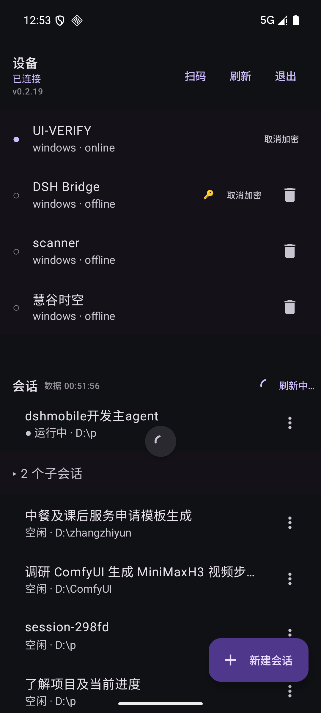
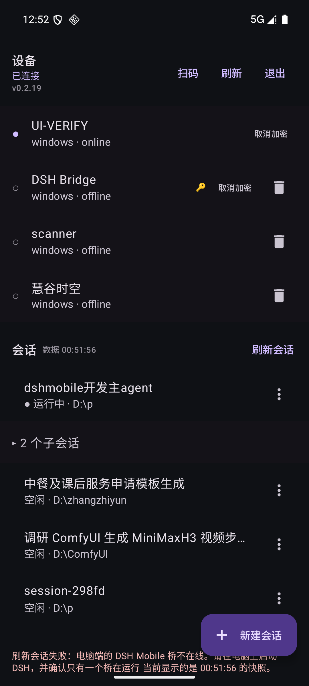
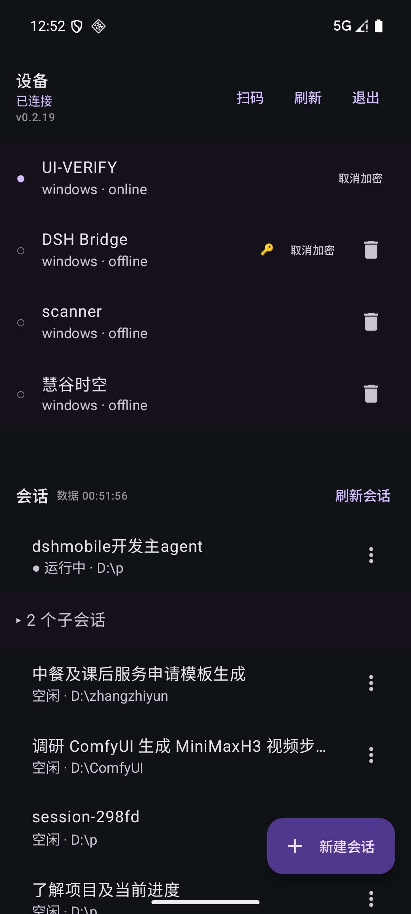

# 会话列表的"可信刷新 + 可信动效"（0.2.20 / 插件 beta.24）

> 起因：用户提出两条要求——
> ① **只要有刷新动作，就必须是最新数据；拿不到最新就不要给"刷新"的动效**；
> ② **新数据来了必须有刷新效果**，而不是"硬变换"（凭空出现/瞬间变色/整列跳变）。
> 本文记录设计、协议增量、验证方式与已知边界。

## 1. 两个层次分别解决什么

| 层次 | 要求 | 实现 |
|---|---|---|
| **第一层：可信刷新** | 有动作 ⇒ 必须对应最新数据；否则不给"成功"的动效 | 见 §2 |
| **第二层：可信动效** | 新数据到达要有连续过渡，而不是硬变换 | 见 §3 |

## 2. 第一层：可信刷新

| 机制 | 位置 | 说明 |
|---|---|---|
| **只有用户主动刷新才显示刷新圈** | `AppRepository.loadSessions(userInitiated)` | 下拉刷新 / 表头「刷新会话」→ 显示刷新圈；连接成功、事件驱动、回前台等**自动刷新一律静默**（无任何动效） |
| **旧响应不得覆盖新响应** | `state/SessionListGate.kt` | 每次刷新取自增序号，只有最新序号的响应允许上屏（并发刷新时先发的慢响应直接被丢弃）——根治"闪了一下反而是旧状态" |
| **内容没变不上屏** | 同上 | 列表内容与当前一致时不做赋值，避免无意义重绘/闪动 |
| **数据时间可见** | 表头「数据 12:03:41」 | 桥在 `sessions.list` 响应里新增 **`servedAt`**（桥生成这份响应的时间）；App 显示之 |
| **失败必须说清是旧快照** | `state/SessionListError.message(code, msg, servedAt)` | 失败保留旧数据，但提示写明"**当前显示的是 12:03:41 的快照**"，绝不假装刷新成功 |
| **刷新圈结束条件** | — | 只在**这次请求的响应**（成功或失败）到达时才停止 |

## 3. 第二层：可信动效

| 变化 | 效果 | 说明 |
|---|---|---|
| 列表插入/移动/删除 | `LazyColumn(key = sessionId)` + `Modifier.animateItem()` | 取代原来的"整列硬切" |
| **黄点出现**（等待审批/提问） | 缩放+淡入 + **脉冲 2 次** + 整行闪光 | 强度最高：代表"你被阻塞了，需要动手" |
| **绿点出现**（跑完未查看） | 缩放+淡入 + 整行闪光（不脉冲） | 强度次之 |
| 标题变色 | `animateColorAsState` | 不再瞬间跳变 |
| 黄点在屏幕外 | 列表顶部提示条「⚠ N 个会话等待你处理 · 点击查看」 | 会话多时否则完全看不见；点击滚动到该行 |

**关键规则**：动效只由**实时事件**驱动（`host/session-flags`），
**首次进入列表 / 普通刷新建立基线时不播**（否则首帧满屏动画）；列表页不可见时不播。

## 4. 协议增量（只增字段/只加帧）

| 帧 / 字段 | 方向 | 语义 |
|---|---|---|
| `sessions.list` 响应的 `servedAt` | 桥 → 手机 | 这份列表数据的生成时刻（毫秒），用于"数据时间" |
| `host/session-flags` | 桥 → 手机 | 黄/绿点集合变化即推（`completedSessionIds` / `pendingSessionIds`），内容与上次相同则不推 |
| `host/session-added` / `removed` / `archived-sessions-changed` | 桥 → 手机 | （既有）列表结构变化 → App 防抖静默重拉 |
| `host/session-activity` / `session-status` | 桥 → 手机 | （既有）App 就地更新 `updatedAt` / `running`，不整表拉取 |

> App 侧新增**全局事件收集器**（此前这些帧只在会话页被消费、列表页全部丢弃，
> 导致"电脑端新建/重命名/归档/跑完"手机列表长期不知情）。

## 5. 验证

- 单测：`SessionListGateTest` 7 项（乱序覆盖/内容不变/顺序变化/基线不播动画/点事件/失败文案带快照）；
  App 单测合计 40 项全绿。
- 桥：`smoke-host-flags.mjs` 28 项（帧实时性 + 去重 + 三种清除路径）、`smoke-dsh-v2.mjs` 新增 8 项断言、
  既有两个 E2EE smoke 与 host-token smoke 全绿。
- **模拟器实机截图**（Android 15 / 1080×2400）：见上方三张图——数据时间、刷新圈、失败快照提示、
  悬浮「新建会话」按钮；用**隔离的临时第二桥**（独立 stateDir + 独立设备身份）验证，未触碰生产 E2EE 配对。

## 6. 已知边界

1. **黄点是会话级**：同一会话有 2 条挂起请求时，应答其中一条不推帧（会话级去重），因此不会显示"2 个待处理"。
2. **会话被删除时**桥既不清绿点也不清黄点（既有行为，`api-session/removed` 分支未改）；
   列表里可能残留这些 id，直到 DSH 自己把它们从列表移除。
3. **`servedAt` 显示的是设备本地时间**：手机与 PC 时区不同时，显示的会是手机本地时刻（绝对时刻相同）。
4. **首次进入/刷新不播点动画**（有意为之）：这类"变化"是基线，不是实时事件。
